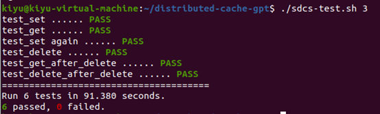
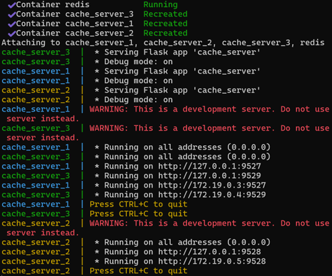
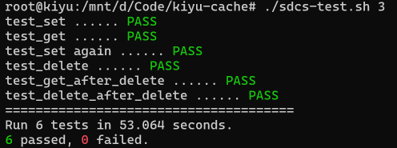

# database-code
电子科技大学分布式系统

（1）运行三次cache_server.py文件，分别在三个终端监听9527、9528、9529三个端口

 （2)测试运行情况。启动新的终端，执行./sdcs-test.sh 3 。成功运行并全部测试通过，测试时间为91.380秒

**第二步：构建和启动** **Docker** **容器**

测试完成后，配置Dockerfile和docker-compose.yml两个文件，将文件打包为docker项目。

本人在windows环境下，使用docker desktop进行容器的构建和启动。

（1）构建docker容器

在项目根目录下，使用以下命令构建并启动 Docker 容器：

docker-compose up –build

或者分别执行

docker-compose build 

docker-compose up -d

（2）验证容器启动

使用 docker ps 查看容器状态，确保所有缓存节点和 Redis 服务已启动。

确认端口映射：确保每个缓存节点的端口映射正确（9527、9528、9529）。

 

**第三步：运行测试脚本**

使用wsl连接虚拟机，在wsl中执行测试脚本

./sdcs-test.sh 3

 

得到测试结果，测试全部通过，时间为53.064s
